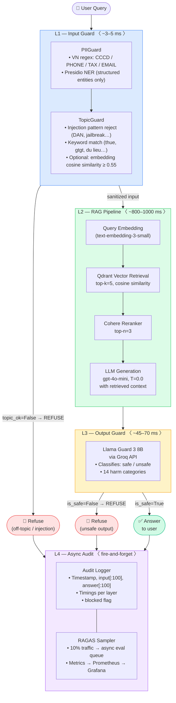

# Production Blueprint: RAG Evaluation & Guardrail System

**System:** Vietnamese Financial & Legal RAG Assistant  
**Domain:** VAT/Tax (Decree on Financial Reporting) + Personal Data Protection (Nghị định 13/2023)  
**Author:** Nguyen Hoang Minh — Lab 24, Track 3, VinUniversity AI Course

---

## Section 1: Service Level Objectives (SLOs)

### SLO-01: Faithfulness (Hallucination Rate)

| Parameter | Value |
|---|---|
| **Metric** | RAGAS `faithfulness` score (0–1) |
| **Target** | ≥ 0.85 (P50 over rolling 24h window) |
| **Error budget** | 15% of eval window may fall below 0.85 |
| **Alert threshold — P2** | < 0.80 sustained for ≥ 30 minutes |
| **Alert threshold — P1** | < 0.70 sustained for ≥ 10 minutes |
| **Measurement** | Sampled RAGAS eval on 10% of production traffic, hourly batch |
| **Rationale** | Vietnamese tax documents have exact line-number citations; hallucinated amounts can cause legal/financial harm |

### SLO-02: Answer Relevancy

| Parameter | Value |
|---|---|
| **Metric** | RAGAS `answer_relevancy` score (0–1) |
| **Target** | ≥ 0.80 (P50 over rolling 24h window) |
| **Alert threshold — P2** | < 0.75 sustained for ≥ 60 minutes |
| **Alert threshold — P1** | < 0.65 sustained for ≥ 20 minutes |
| **Measurement** | Same 10% sampled RAGAS batch as SLO-01 |
| **Rationale** | Off-topic answers erode user trust and increase escalation load |

### SLO-03: End-to-End P95 Latency

| Parameter | Value |
|---|---|
| **Metric** | Total pipeline latency (L1 + L2 + L3), P95 |
| **Target** | < 2,500 ms at P95 |
| **Alert threshold — P2** | P95 > 2,000 ms for ≥ 5 minutes |
| **Alert threshold — P1** | P95 > 4,000 ms for ≥ 2 minutes |
| **Measurement** | Real-time instrumentation on every request (Prometheus histogram) |
| **Breakdown budget** | L1 < 50 ms · L3 < 100 ms · L2 (RAG) remainder |
| **Rationale** | User-facing chat interface; latency above 2.5 s degrades perceived quality |

### SLO-04: Guardrail False Positive Rate

| Parameter | Value |
|---|---|
| **Metric** | Rate of legitimate queries blocked by L1 (PII + TopicGuard) or L3 (Llama Guard) |
| **Target** | < 5% of all legitimate production queries blocked |
| **Alert threshold — P2** | FP rate > 10% over any 1-hour window |
| **Alert threshold — P1** | FP rate > 25% over any 15-minute window |
| **Measurement** | Sample 200 randomly selected passed + blocked queries weekly; human spot-check |
| **Rationale** | High FP rate makes the assistant unusable; current baseline: 0% FP in adversarial test |

### SLO-05: Adversarial Attack Detection Rate

| Parameter | Value |
|---|---|
| **Metric** | % of known adversarial patterns blocked by L1 TopicGuard |
| **Target** | ≥ 95% detection rate |
| **Alert threshold — P2** | Detection rate < 90% on monthly red-team exercise |
| **Alert threshold — P1** | Any novel jailbreak bypass confirmed in production |
| **Measurement** | Monthly automated red-team run (adversarial_test.py) + manual review |
| **Rationale** | Current baseline: 95% (19/20 attacks blocked); protect against prompt injection |

### SLO-06: Availability (Pipeline Uptime)

| Parameter | Value |
|---|---|
| **Metric** | % of requests that return a response (not 5xx/timeout) |
| **Target** | ≥ 99.5% over rolling 30-day window |
| **Alert threshold — P2** | Error rate > 1% for ≥ 5 minutes |
| **Alert threshold — P1** | Error rate > 5% for ≥ 2 minutes |
| **Measurement** | HTTP success rate from load balancer access logs |
| **Rationale** | RAG pipeline depends on Qdrant vector DB + Groq API; both need health monitoring |

---

## Section 2: System Architecture

### Defense-in-Depth Stack (Mermaid Diagram)



### Component Responsibilities

| Layer | Component | SLA budget | Failure mode |
|---|---|---|---|
| L1 | PIIGuard | < 10 ms | Regex engine timeout → pass-through with warning |
| L1 | TopicGuard | < 50 ms | Embedding API down → keyword-only fallback |
| L2 | Qdrant retrieval | < 300 ms | DB unavailable → `rag_adapter` mock response |
| L2 | Cohere reranker | < 200 ms | API down → return unranked top-k |
| L2 | GPT-4o-mini gen | < 500 ms | Timeout → cached answer or refusal |
| L3 | Llama Guard 3 | < 100 ms | Groq timeout → **fail-safe: block response** |
| L4 | Audit + RAGAS | async | Dropped → retry queue (Celery/RQ) |

---

## Section 3: Incident Playbooks

### Playbook 1: Faithfulness Drop (SLO-01 Breach)

**Trigger:** `faithfulness` P50 < 0.80 for ≥ 30 minutes (P2 alert)

**Symptoms:**
- Grafana dashboard shows `ragas_faithfulness_p50` below red line
- Users report "the answer says wrong tax amount"

**Diagnosis steps:**

```
1. Check RAGAS sample logs:
   $ grep "faithfulness < 0.80" /var/log/ragas/sampled_evals.jsonl | tail -50

2. Identify failure cluster:
   - If failures cluster on "multi_context" evolution_type → retriever issue
   - If failures cluster on "reasoning" evolution_type → generation issue

3. Check Qdrant health:
   $ curl http://qdrant:6333/healthz

4. Check reranker:
   $ curl -X POST https://api.cohere.ai/rerank -H "Authorization: Bearer $COHERE_API_KEY" \
       -d '{"query": "test", "documents": ["doc1"], "model": "rerank-multilingual-v3.0"}'

5. Sample 5 failing Q&A pairs and verify manually:
   - Does retrieved context contain the answer?
   - Is generation ignoring the context?
```

**Remediation:**

| Root cause | Fix |
|---|---|
| Retriever returning wrong chunks | Increase `RERANK_TOP_K` from 3 → 6; check embedding model version |
| Stale vector index | Re-index documents: `python scripts/reindex.py --collection rag_prod` |
| LLM ignoring context | Add "Answer ONLY from the provided context" to system prompt; lower temperature |
| Nghị định 13 docs missing | Verify all 4 document chunks are in Qdrant: `python scripts/check_index.py` |

**Escalation:** If P50 < 0.70 persists > 10 minutes → P1 → page on-call ML engineer + disable RAG (serve cached answers)

---

### Playbook 2: Guardrail False Positive Spike (SLO-04 Breach)

**Trigger:** FP rate > 10% over 1-hour window (P2 alert); users reporting "Why won't it answer my tax question?"

**Symptoms:**
- Audit log shows `blocked=True` for queries containing "thue GTGT"
- TopicGuard `reason` contains "Potential prompt injection detected: 'dan'" but query is "nguyen van dan"

**Diagnosis steps:**

```
1. Pull blocked queries from audit log (last 1 hour):
   $ python scripts/audit_query.py --blocked --since 1h

2. Classify false positives:
   - Injection keyword false match (e.g., "dan" in a name)
   - PII scrubbing destroying keyword match ("thue 0987654321" → "thue [PHONE_VN]" → blocked?)
   - Presidio NER misclassifying domain terms as PERSON

3. Run adversarial_test.py to verify FP rate:
   $ cd phase-c && python adversarial_test.py

4. Check which injection keyword triggered:
   grep "injection_patterns" phase-c/input_guard.py
```

**Remediation:**

| Root cause | Fix |
|---|---|
| "dan" matches "nguyen van dan" | Add word-boundary to injection patterns: `r'\bdan\b'` (or remove, too broad) |
| Presidio misclassifying Vietnamese terms | Audit `_SAFE_ENTITIES` list; remove problematic entity types |
| Keyword list doesn't cover new query patterns | Add missing keywords to `TopicGuard.KEYWORDS` |
| PII scrubbing breaks keyword match | Ensure keyword check runs on sanitized text (current behavior) |

**Verification:** After fix, run `python adversarial_test.py` — FP must be 0/10 before re-enabling

---

### Playbook 3: P95 Latency Spike (SLO-03 Breach)

**Trigger:** P95 latency > 2,000 ms for ≥ 5 minutes (P2 alert)

**Symptoms:**
- Grafana `pipeline_latency_p95` > 2000 ms
- Users report chat is "slow / frozen"

**Diagnosis steps:**

```
1. Check per-layer latency breakdown from recent audit log:
   $ python scripts/latency_report.py --since 10m
   Expected: L1~3ms, L2~850ms, L3~50ms

2. Identify which layer is slow:

   IF L1_ms > 50:
     → Presidio NER spike (check Presidio version / model load)
     → Regex catastrophic backtracking (check VN_PII patterns against long inputs)

   IF L2_ms > 1500:
     → Qdrant slow: check DB memory usage, index fragmentation
     → Cohere API: check https://status.cohere.com
     → GPT-4o-mini: check https://status.openai.com; long context → throttling

   IF L3_ms > 100:
     → Groq API: check https://status.groq.com
     → Groq rate limit exceeded (free tier: 30 req/min for llama-guard-3-8b)
```

**Remediation:**

| Root cause | Fix |
|---|---|
| Groq rate limit | Implement request queue with 2s spacing; upgrade to paid tier |
| Qdrant memory pressure | Increase Docker memory limit; run `OPTIMIZE` collection |
| OpenAI throttling | Add retry with exponential backoff; enable response streaming |
| Presidio load time | Pre-warm Presidio on startup; cache `AnalyzerEngine` singleton |
| Long input slow regex | Add input length cap: `if len(text) > 2000: text = text[:2000]` |

**Emergency mitigation:** If P95 > 4,000 ms → P1 → disable L3 (Llama Guard) temporarily; L1 still blocks injections; re-enable L3 after Groq stabilizes

---

## Section 4: Cost Analysis (100,000 Queries/Month)

### Assumptions

- 100,000 production queries/month
- Average query length: 50 tokens; average context: 600 tokens; average answer: 200 tokens
- RAGAS sampled eval: 10% of traffic = 10,000 evals/month
- LLM judge: monthly pairwise eval run on 500 query sample
- 730 hours/month (continuous operation)

### Cost Breakdown

#### 4.1 RAG Generation (L2) — GPT-4o-mini

| Item | Calculation | Cost |
|---|---|---|
| Input tokens | 100,000 queries × (50 prompt + 600 context) = 65M tokens | $65,000,000 × $0.15/1M = **$9.75** |
| Output tokens | 100,000 × 200 tokens = 20M tokens | $20,000,000 × $0.60/1M = **$12.00** |
| **RAG subtotal** | | **$21.75/month** |

#### 4.2 RAGAS Evaluation (10% sampling)

RAGAS uses GPT-4o-mini for faithfulness and answer_relevancy computation.

| Item | Calculation | Cost |
|---|---|---|
| Faithfulness | 10,000 evals × 4 LLM calls × 800 tokens = 32M tokens | $32M × $0.15/1M = **$4.80** |
| Answer relevancy | 10,000 × 2 calls × 600 tokens = 12M tokens | $12M × $0.15/1M = **$1.80** |
| Context precision/recall | 10,000 × 4 calls × 500 tokens = 20M tokens | $20M × $0.15/1M = **$3.00** |
| **RAGAS subtotal** | | **$9.60/month** |

#### 4.3 LLM Judge (Phase B) — Monthly Calibration Run

| Item | Calculation | Cost |
|---|---|---|
| Pairwise comparison | 500 pairs × 2 swaps × 1,200 tokens = 1.2M tokens | $1.2M × $0.15/1M = **$0.18** |
| **Judge subtotal** | | **$0.18/month** |

#### 4.4 Output Guard (L3) — Llama Guard 3 via Groq

Groq free tier: 14,400 requests/day = 432,000/month → covers 100k queries at 100% check rate.

| Item | Calculation | Cost |
|---|---|---|
| Groq free tier | 100,000 queries × 1 L3 check = 100,000 calls | **$0.00** (within free tier) |
| Groq paid (if >432k/month) | $0.20/1M tokens × 100k × 250 tokens = 25M | **$5.00** |
| **L3 subtotal** | | **$0.00 – $5.00/month** |

#### 4.5 Input Guard (L1) — Presidio NER

Self-hosted library — no API cost. Infrastructure cost only.

| Item | Calculation | Cost |
|---|---|---|
| Presidio compute | 1 vCPU sufficient at 100k queries/month | **~$0.05/hour × 730h = $36.50** |
| **L1 subtotal** | | **$36.50/month** |

#### 4.6 Embedding (Query + TopicGuard similarity)

| Item | Calculation | Cost |
|---|---|---|
| Query embedding (L2 RAG) | 100,000 × 50 tokens = 5M tokens | $5M × $0.02/1M = **$0.10** |
| TopicGuard embedding (fallback) | ~5,000 × 50 tokens = 250k tokens | $250k × $0.02/1M = **$0.005** |
| **Embedding subtotal** | | **$0.11/month** |

#### 4.7 Cohere Reranker

| Item | Calculation | Cost |
|---|---|---|
| Rerank calls | 100,000 queries × 5 docs = 500,000 docs | 500k docs × $0.001/doc (Cohere rerank-3) = **$0.50** |
| **Reranker subtotal** | | **$0.50/month** |

#### 4.8 Infrastructure (Qdrant + Hosting)

| Item | Cost |
|---|---|
| Qdrant Cloud (1GB RAM, 10GB disk) | **$35/month** |
| App server (2 vCPU, 4GB RAM) | **$20/month** |
| **Infra subtotal** | **$55/month** |

### Total Monthly Cost Summary

| Component | Cost/month |
|---|---|
| RAG Generation (GPT-4o-mini) | $21.75 |
| RAGAS Evaluation (10% sample) | $9.60 |
| LLM Judge (monthly calibration) | $0.18 |
| Output Guard — Groq Llama Guard | $0.00–$5.00 |
| Input Guard — Presidio (compute) | $36.50 |
| Embeddings (text-embedding-3-small) | $0.11 |
| Cohere Reranker | $0.50 |
| Infrastructure (Qdrant + App) | $55.00 |
| **TOTAL** | **$123.64–$128.64/month** |

**Cost per query:** ~$0.0012–$0.0013 (~1.2 VND at current rates)

### Cost Optimization Opportunities

| Lever | Saving | Trade-off |
|---|---|---|
| Reduce RAGAS sample to 5% | –$4.80/month | Less frequent quality signal |
| Switch L2 gen to `gpt-4o-mini` batch API | –30% gen cost = –$6.50 | 24h latency on batch, not real-time |
| Cache top-50 frequent queries | –20% RAG calls = –$4.35 | Stale answers risk; needs TTL |
| Self-host Llama Guard 3 (GPU) | –$5/month API; +$30 GPU | Only viable at >500k queries/month |
| Use `text-embedding-3-small` (already cheapest) | N/A | Already optimal |
